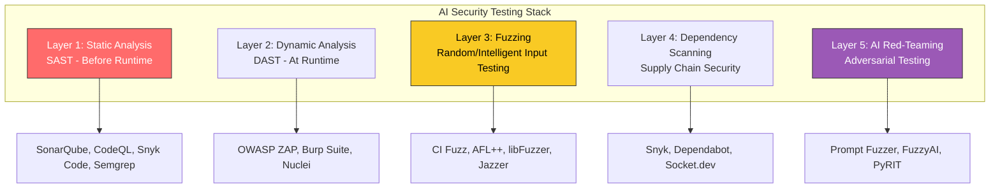
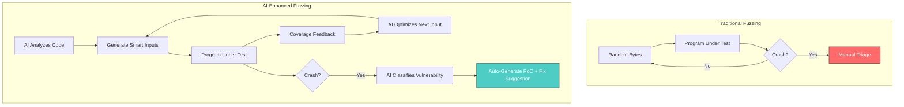
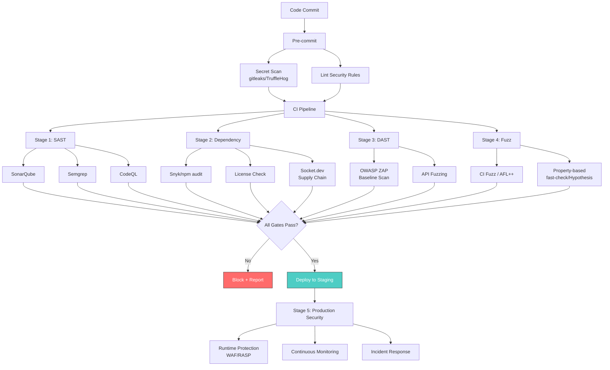
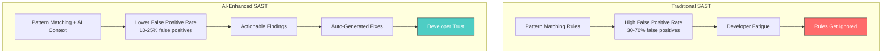
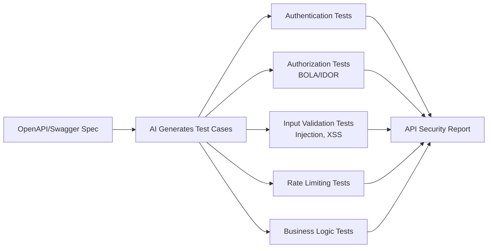
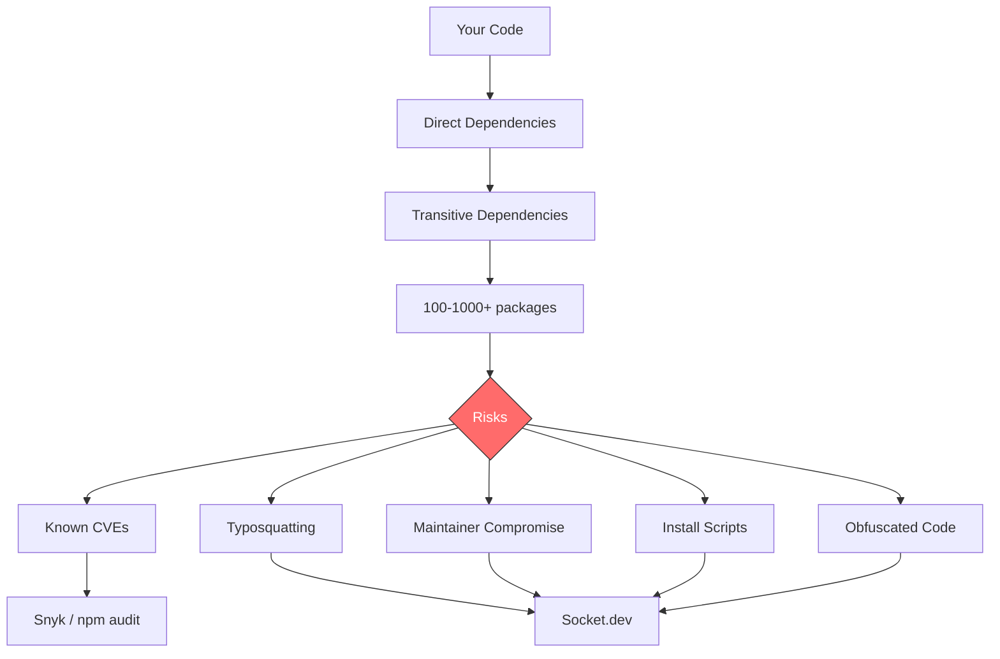
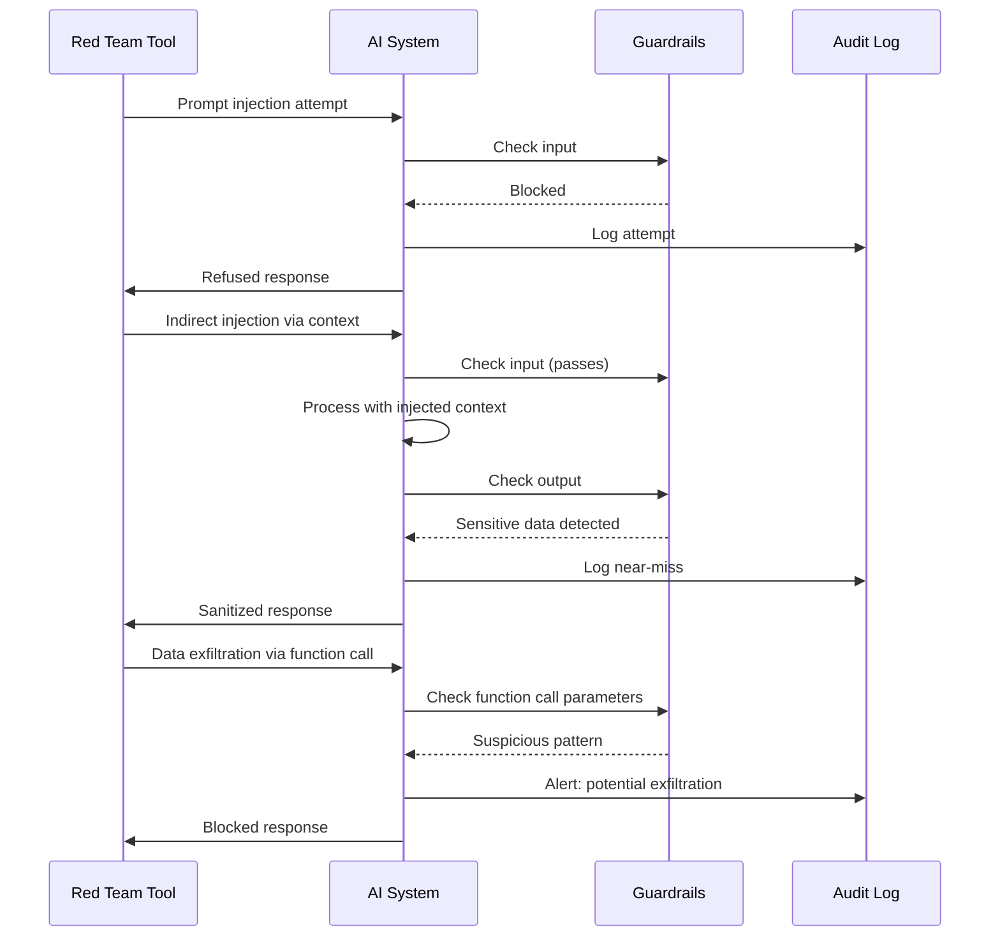

# AI-Assisted Fuzzing and Security Testing

> Tools, techniques, and integration with Claude Code for fuzzing, SAST, DAST, dependency scanning, and AI red-teaming.

---

## Table of Contents

- [Overview](#overview)
- [AI Fuzzing Landscape](#ai-fuzzing-landscape)
- [Fuzzing Tools and Frameworks](#fuzzing-tools-and-frameworks)
- [Security Testing Pipeline](#security-testing-pipeline)
- [SAST with AI Enhancement](#sast-with-ai-enhancement)
- [DAST and API Security](#dast-and-api-security)
- [Dependency and Supply Chain Security](#dependency-and-supply-chain-security)
- [AI Red-Teaming](#ai-red-teaming)
- [Claude Code Integration](#claude-code-integration)

---

## Overview

### Why AI-Generated Code Needs Security Testing

AI-generated code inherits vulnerability patterns from its training data. Research shows AI-generated code has a vulnerability density of **1.5-4 per KLOC** (compared to industry median of 2.5/KLOC). Common patterns include:

- SQL injection via string concatenation
- Path traversal with unsanitized user input
- Hardcoded credentials and API keys
- Missing authentication checks
- Insecure deserialization
- XSS via unescaped output



---

## AI Fuzzing Landscape

### What AI Brings to Fuzzing

Traditional fuzzing generates random inputs blindly. AI-enhanced fuzzing adds:

1. **Grammar-aware generation**: AI understands input formats (JSON, XML, SQL) and generates structurally valid but semantically adversarial inputs
2. **Coverage-guided optimization**: AI analyzes which inputs explore new code paths and steers generation accordingly
3. **Crash triaging**: AI categorizes and de-duplicates crashes automatically
4. **Vulnerability classification**: AI determines if a crash is exploitable
5. **Test harness generation**: AI writes the fuzz test scaffolding from source code



---

## Fuzzing Tools and Frameworks

### Tool Comparison (2025-2026)

| Tool | Type | AI Features | Languages | Best For |
|------|------|-------------|-----------|----------|
| **CI Fuzz (Code Intelligence)** | White-box | AI Test Agent, auto harness generation | C/C++, Java, Go, JS, Python | CI/CD integration, enterprise |
| **AFL++** | Coverage-guided | Community AI extensions | C/C++ (primary), any via harness | Low-level systems code |
| **libFuzzer** | In-process | None (pair with AI) | C/C++ | LLVM-based projects |
| **Jazzer** | Coverage-guided | None (pair with AI) | Java, Kotlin | JVM applications |
| **OSS-Fuzz** | Continuous | Google infra, auto bug tracking | C/C++, Go, Rust, Python, Java | Open source projects |
| **Atheris** | Coverage-guided | None (pair with AI) | Python | Python native extensions |
| **jsfuzz** | Coverage-guided | None (pair with AI) | JavaScript | Node.js parsers/validators |

### CI Fuzz: The AI-First Approach

CI Fuzz represents the most advanced AI-integrated fuzzing tool in 2025-2026:

- **AI Test Agent**: Autonomously generates fuzz test harnesses by analyzing source code
- **Automated Triage**: Classifies bugs by type and severity
- **CI/CD Native**: Integrates directly into GitHub Actions, GitLab CI, Jenkins
- **White-box**: Instruments code for coverage-guided fuzzing
- **Languages**: C/C++, Java, Go, JavaScript, Python

```yaml
# .github/workflows/fuzz.yml - CI Fuzz integration
name: Fuzz Testing

on:
  pull_request:
    paths:
      - 'src/parsers/**'
      - 'src/validators/**'
      - 'src/crypto/**'
  schedule:
    - cron: '0 2 * * *'  # Nightly full fuzz

jobs:
  fuzz:
    runs-on: ubuntu-latest
    steps:
      - uses: actions/checkout@v4

      - name: Run CI Fuzz
        uses: CodeIntelligenceTesting/ci-fuzz-action@v2
        with:
          project: my-project
          fuzz-targets: |
            src/parsers/json_parser_fuzz_test
            src/validators/input_validator_fuzz_test
          duration: 600  # 10 minutes per target
          # AI Test Agent generates harnesses if missing
          ai-generate-harnesses: true

      - name: Upload Findings
        if: failure()
        uses: actions/upload-artifact@v4
        with:
          name: fuzz-findings
          path: .cifuzz/findings/
```

### Writing Fuzz Tests with Claude Code

#### Go Example

```go
// fuzz_test.go - Generated by Claude Code /fuzz skill
package parser

import (
    "testing"
)

func FuzzParseJSON(f *testing.F) {
    // Seed corpus with valid inputs
    f.Add([]byte(`{"name": "test", "age": 30}`))
    f.Add([]byte(`[]`))
    f.Add([]byte(`"simple string"`))
    f.Add([]byte(`null`))
    f.Add([]byte(`{"nested": {"deep": {"value": 42}}}`))

    // Adversarial seeds
    f.Add([]byte(`{"key": "\u0000\u001f"}`))           // Control characters
    f.Add([]byte(`{"key": "` + string(make([]byte, 10000)) + `"}`)) // Large value
    f.Add([]byte(`{`))                                   // Truncated
    f.Add([]byte(`{"a":{"a":{"a":{"a":{"a":{}}}}}}`))   // Deep nesting

    f.Fuzz(func(t *testing.T, data []byte) {
        result, err := ParseJSON(data)
        if err != nil {
            // Errors are expected for invalid input - just don't panic
            return
        }

        // Round-trip property: parse -> serialize -> parse should be stable
        serialized, err := SerializeJSON(result)
        if err != nil {
            t.Fatalf("Failed to serialize valid parse result: %v", err)
        }

        result2, err := ParseJSON(serialized)
        if err != nil {
            t.Fatalf("Failed to re-parse serialized result: %v", err)
        }

        if !DeepEqual(result, result2) {
            t.Fatalf("Round-trip mismatch:\nOriginal:  %v\nRe-parsed: %v", result, result2)
        }
    })
}
```

#### JavaScript Example (with jsfuzz)

```javascript
// fuzz.js - Generated by Claude Code /fuzz skill
const { fuzz } = require('jsfuzz');
const { parseConfig } = require('../src/config-parser');

function fuzzTarget(data) {
  try {
    const config = parseConfig(data.toString('utf-8'));

    // If parsing succeeds, verify invariants
    if (config !== null) {
      // Config should always have these required fields
      if (typeof config.version === 'undefined') {
        throw new Error('Missing required field: version');
      }

      // Values should be within expected ranges
      if (config.timeout && (config.timeout < 0 || config.timeout > 3600000)) {
        throw new Error(`Timeout out of range: ${config.timeout}`);
      }

      // Serialization round-trip
      const serialized = JSON.stringify(config);
      const reparsed = parseConfig(serialized);
      if (JSON.stringify(reparsed) !== serialized) {
        throw new Error('Round-trip serialization failed');
      }
    }
  } catch (e) {
    // Expected parsing errors are fine
    if (e.message.includes('Invalid config') || e.message.includes('Syntax error')) {
      return;
    }
    // Unexpected errors are bugs
    throw e;
  }
}

module.exports = { fuzzTarget };
```

#### Python Example (with Atheris)

```python
# fuzz_test.py - Generated by Claude Code /fuzz skill
import atheris
import sys

with atheris.instrument_imports():
    from src.validators import validate_email, validate_url, sanitize_html

def test_email_validator(data):
    """Fuzz the email validator - should never crash, only return True/False."""
    fdp = atheris.FuzzedDataProvider(data)
    email = fdp.ConsumeUnicodeNoSurrogates(256)

    try:
        result = validate_email(email)
        assert isinstance(result, bool), f"Expected bool, got {type(result)}"
    except ValueError:
        pass  # Expected for invalid emails
    except Exception as e:
        raise AssertionError(f"Unexpected exception: {type(e).__name__}: {e}")

def test_html_sanitizer(data):
    """Fuzz the HTML sanitizer - output should never contain script tags."""
    fdp = atheris.FuzzedDataProvider(data)
    html = fdp.ConsumeUnicodeNoSurrogates(4096)

    sanitized = sanitize_html(html)

    # Critical invariant: no script execution in output
    assert "<script" not in sanitized.lower(), f"Script tag survived sanitization: {sanitized[:200]}"
    assert "javascript:" not in sanitized.lower(), f"JS protocol survived: {sanitized[:200]}"
    assert "onerror=" not in sanitized.lower(), f"Event handler survived: {sanitized[:200]}"
    assert "onload=" not in sanitized.lower(), f"Event handler survived: {sanitized[:200]}"

def main():
    atheris.Setup(sys.argv, test_html_sanitizer)
    atheris.Fuzz()

if __name__ == "__main__":
    main()
```

---

## Security Testing Pipeline

### Complete Security Pipeline Architecture



### Security Tool Configuration

#### Semgrep Configuration

```yaml
# .semgrep.yml
rules:
  # AI-generated code commonly has these issues
  - id: sql-injection-string-concat
    patterns:
      - pattern: |
          $QUERY = "..." + $INPUT + "..."
      - pattern: |
          $QUERY = f"...{$INPUT}..."
    message: "Potential SQL injection via string concatenation. Use parameterized queries."
    languages: [python, javascript, typescript]
    severity: ERROR

  - id: hardcoded-secret
    patterns:
      - pattern: |
          $KEY = "sk-..."
      - pattern: |
          $KEY = "ghp_..."
      - pattern: |
          $KEY = "AKIA..."
    message: "Hardcoded secret detected. Use environment variables."
    languages: [python, javascript, typescript, java]
    severity: ERROR

  - id: path-traversal
    pattern: |
      os.path.join($BASE, request.$FIELD)
    message: "Potential path traversal. Validate and normalize the path."
    languages: [python]
    severity: WARNING

  - id: missing-auth-check
    patterns:
      - pattern: |
          @app.route($PATH, methods=["POST", ...])
          def $FUNC(...):
              ...
      - pattern-not: |
          @app.route($PATH, methods=["POST", ...])
          @requires_auth
          def $FUNC(...):
              ...
    message: "POST endpoint without authentication decorator."
    languages: [python]
    severity: WARNING
```

#### OWASP ZAP Configuration

```yaml
# zap-config.yml - Baseline scan configuration
env:
  contexts:
    - name: "My Application"
      urls:
        - "http://localhost:3000"
      includePaths:
        - "http://localhost:3000/api/.*"
      excludePaths:
        - "http://localhost:3000/healthz"
      authentication:
        method: "json"
        parameters:
          loginPageUrl: "http://localhost:3000/api/auth/login"
          loginRequestUrl: "http://localhost:3000/api/auth/login"
          loginRequestBody: '{"email":"","password":""}'
        verification:
          method: "response"
          loggedInRegex: "\\Qaccess_token\\E"

jobs:
  - type: spider
    parameters:
      maxDuration: 5
      maxDepth: 5

  - type: spiderAjax
    parameters:
      maxDuration: 5

  - type: passiveScan-wait
    parameters:
      maxDuration: 10

  - type: activeScan
    parameters:
      maxRuleDurationInMins: 5
      maxScanDurationInMins: 30
    policyDefinition:
      rules:
        - id: 40012  # Cross Site Scripting (Reflected)
          strength: high
        - id: 40014  # Cross Site Scripting (Persistent)
          strength: high
        - id: 40018  # SQL Injection
          strength: high
        - id: 40019  # SQL Injection (MySQL)
          strength: high
        - id: 90021  # XPath Injection
          strength: medium

  - type: report
    parameters:
      template: "traditional-json"
      reportDir: "./reports/zap/"
```

#### GitHub Actions: OWASP ZAP Integration

```yaml
# .github/workflows/security-scan.yml
name: Security Scan

on:
  pull_request:
    branches: [main]
  schedule:
    - cron: '0 3 * * 1'  # Weekly Monday at 3 AM

jobs:
  sast:
    runs-on: ubuntu-latest
    steps:
      - uses: actions/checkout@v4

      - name: Semgrep SAST
        uses: semgrep/semgrep-action@v1
        with:
          config: >-
            p/default
            p/owasp-top-ten
            p/javascript
            p/typescript
            .semgrep.yml

      - name: CodeQL Analysis
        uses: github/codeql-action/analyze@v3
        with:
          languages: javascript-typescript

  dast:
    runs-on: ubuntu-latest
    needs: [sast]
    services:
      app:
        image: my-app:latest
        ports:
          - 3000:3000
    steps:
      - uses: actions/checkout@v4

      - name: OWASP ZAP Scan
        uses: zaproxy/action-full-scan@v0.10.0
        with:
          target: 'http://localhost:3000'
          rules_file_name: 'zap-config.yml'
          cmd_options: '-a'

      - name: Upload ZAP Report
        if: always()
        uses: actions/upload-artifact@v4
        with:
          name: zap-report
          path: reports/zap/

  dependency-check:
    runs-on: ubuntu-latest
    steps:
      - uses: actions/checkout@v4

      - name: Snyk Dependency Scan
        uses: snyk/actions/node@master
        env:
          SNYK_TOKEN: ${{ secrets.SNYK_TOKEN }}
        with:
          args: --severity-threshold=medium --json-file-output=snyk-report.json

      - name: Socket.dev Supply Chain Analysis
        uses: SocketDev/socket-sdk-js@v1
        with:
          api_key: ${{ secrets.SOCKET_API_KEY }}
```

---

## SAST with AI Enhancement

### AI-Enhanced Static Analysis Tools (2026)

| Tool | AI Capabilities | Languages | Integration |
|------|----------------|-----------|-------------|
| **SonarQube** | AI CodeFix suggestions, auto-remediation | 30+ languages | CI/CD, IDE |
| **Semgrep** | Custom rules + AI pattern matching | 30+ languages | CI/CD, pre-commit |
| **CodeQL** | Semantic analysis, dataflow tracking | 10+ languages | GitHub native |
| **Snyk Code** | AI-powered fix suggestions, real-time scanning | 10+ languages | IDE, CI/CD |
| **CodeRabbit** | AI PR review with security focus | Language-agnostic | GitHub/GitLab |
| **Codacy** | AI pattern detection, security scoring | 40+ languages | CI/CD, IDE |

### How AI Improves SAST



---

## DAST and API Security

### API Security Testing



### API Fuzzing Tools

| Tool | Approach | AI Features | Best For |
|------|----------|-------------|----------|
| **APIsec** | Automated API pen testing | AI-generated attack scenarios | REST/GraphQL APIs |
| **OWASP ZAP** | Proxy-based DAST | Spider + active scanning | Web applications |
| **Burp Suite** | Proxy-based DAST | Extensions for AI | Professional pen testing |
| **Nuclei** | Template-based scanning | Community templates | Known vulnerability checks |
| **RESTler** | Stateful API fuzzing | Grammar-based generation | REST API coverage |

### Claude Code API Security Test Skill

```markdown
## /api-security-test Skill

Generate security-focused API tests from an OpenAPI spec or route definitions.

**Input:**
- OpenAPI/Swagger spec file OR route definitions
- Authentication mechanism description
- Known user roles

**Generated Tests:**

1. **Authentication Bypass**
   - Missing auth header
   - Expired token
   - Malformed token
   - Token from different environment

2. **Broken Object-Level Authorization (BOLA/IDOR)**
   - Access resource with another user's ID
   - Enumerate IDs to find accessible resources
   - Modify resource owned by another user

3. **Input Injection**
   - SQL injection in query parameters
   - NoSQL injection in JSON bodies
   - XSS in stored data fields
   - Path traversal in file parameters
   - SSRF in URL parameters

4. **Business Logic**
   - Negative quantities/amounts
   - Race conditions on state changes
   - Replay attacks
   - Parameter pollution

5. **Rate Limiting & DoS**
   - Rapid-fire requests
   - Large payload bodies
   - Recursive/nested structures

**Output:** Test file using the project's test framework (Jest/pytest/etc.)
```

### Working API Security Test Example

```typescript
// Generated by Claude Code /api-security-test skill
import request from 'supertest';
import { app } from '../src/app';
import { createTestUser, getAuthToken } from './helpers';

describe('API Security: /api/users/:id', () => {
  let userA: { id: string; token: string };
  let userB: { id: string; token: string };
  let adminUser: { id: string; token: string };

  beforeAll(async () => {
    userA = await createTestUser('userA@test.com', 'user');
    userB = await createTestUser('userB@test.com', 'user');
    adminUser = await createTestUser('admin@test.com', 'admin');
  });

  describe('Authentication', () => {
    it('returns 401 without auth header', async () => {
      await request(app).get(`/api/users/${userA.id}`).expect(401);
    });

    it('returns 401 with expired token', async () => {
      const expiredToken = getAuthToken(userA.id, { expiresIn: '-1h' });
      await request(app)
        .get(`/api/users/${userA.id}`)
        .set('Authorization', `Bearer ${expiredToken}`)
        .expect(401);
    });

    it('returns 401 with malformed token', async () => {
      await request(app)
        .get(`/api/users/${userA.id}`)
        .set('Authorization', 'Bearer not-a-real-token')
        .expect(401);
    });
  });

  describe('Authorization (BOLA/IDOR)', () => {
    it('prevents user from accessing another user profile', async () => {
      const res = await request(app)
        .get(`/api/users/${userB.id}`)
        .set('Authorization', `Bearer ${userA.token}`)
        .expect(403);

      expect(res.body).not.toHaveProperty('email');
      expect(res.body).not.toHaveProperty('phone');
    });

    it('prevents user from modifying another user profile', async () => {
      await request(app)
        .put(`/api/users/${userB.id}`)
        .set('Authorization', `Bearer ${userA.token}`)
        .send({ name: 'Hacked' })
        .expect(403);
    });

    it('allows admin to access any user', async () => {
      await request(app)
        .get(`/api/users/${userA.id}`)
        .set('Authorization', `Bearer ${adminUser.token}`)
        .expect(200);
    });
  });

  describe('Input Injection', () => {
    it('resists SQL injection in path parameter', async () => {
      const maliciousId = "1' OR '1'='1";
      const res = await request(app)
        .get(`/api/users/${encodeURIComponent(maliciousId)}`)
        .set('Authorization', `Bearer ${adminUser.token}`);

      // Should return 400 or 404, never 200 with multiple users
      expect([400, 404]).toContain(res.status);
    });

    it('resists NoSQL injection in query', async () => {
      const res = await request(app)
        .get('/api/users')
        .query({ email: { $gt: '' } })
        .set('Authorization', `Bearer ${adminUser.token}`);

      expect([400, 422]).toContain(res.status);
    });

    it('sanitizes XSS in stored fields', async () => {
      const xssPayload = '<script>alert("xss")</script>';
      await request(app)
        .put(`/api/users/${userA.id}`)
        .set('Authorization', `Bearer ${userA.token}`)
        .send({ name: xssPayload });

      const res = await request(app)
        .get(`/api/users/${userA.id}`)
        .set('Authorization', `Bearer ${userA.token}`)
        .expect(200);

      expect(res.body.name).not.toContain('<script>');
    });

    it('prevents path traversal', async () => {
      const traversalId = '../../../etc/passwd';
      await request(app)
        .get(`/api/users/${encodeURIComponent(traversalId)}`)
        .set('Authorization', `Bearer ${adminUser.token}`)
        .expect(400);
    });
  });

  describe('Rate Limiting', () => {
    it('enforces rate limits', async () => {
      const requests = Array.from({ length: 100 }, () =>
        request(app)
          .get(`/api/users/${userA.id}`)
          .set('Authorization', `Bearer ${userA.token}`)
      );

      const responses = await Promise.all(requests);
      const rateLimited = responses.filter((r) => r.status === 429);
      expect(rateLimited.length).toBeGreaterThan(0);
    });
  });

  describe('Large Payloads', () => {
    it('rejects oversized request bodies', async () => {
      const largePayload = { name: 'A'.repeat(1_000_000) };
      await request(app)
        .put(`/api/users/${userA.id}`)
        .set('Authorization', `Bearer ${userA.token}`)
        .send(largePayload)
        .expect(413);
    });

    it('rejects deeply nested JSON', async () => {
      let nested: any = { value: 'deep' };
      for (let i = 0; i < 100; i++) {
        nested = { child: nested };
      }

      await request(app)
        .put(`/api/users/${userA.id}`)
        .set('Authorization', `Bearer ${userA.token}`)
        .send(nested)
        .expect(400);
    });
  });
});
```

---

## Dependency and Supply Chain Security

### The Supply Chain Threat



### Supply Chain Security Tools

| Tool | Focus | Detection Method |
|------|-------|-----------------|
| **Snyk** | Known CVEs, license compliance | Vulnerability database matching |
| **Socket.dev** | Supply chain attacks, typosquatting | Behavioral analysis of packages |
| **Dependabot** | Outdated dependencies | Version tracking + CVE database |
| **npm audit** | Known CVEs in npm packages | Advisory database |
| **Renovate** | Automated dependency updates | Version tracking + auto-PR |

### Automated Dependency Management

```yaml
# renovate.json
{
  "$schema": "https://docs.renovatebot.com/renovate-schema.json",
  "extends": ["config:recommended", "security:openssf-scorecard"],
  "vulnerabilityAlerts": {
    "labels": ["security"],
    "automerge": false,
    "assignees": ["security-team"]
  },
  "packageRules": [
    {
      "matchUpdateTypes": ["patch"],
      "automerge": true,
      "automergeType": "pr",
      "requiredStatusChecks": ["test", "security-scan"]
    },
    {
      "matchUpdateTypes": ["minor"],
      "automerge": true,
      "automergeType": "pr",
      "stabilityDays": 3,
      "requiredStatusChecks": ["test", "security-scan"]
    },
    {
      "matchUpdateTypes": ["major"],
      "automerge": false,
      "labels": ["breaking-change"]
    }
  ],
  "prConcurrentLimit": 5,
  "prHourlyLimit": 2
}
```

---

## AI Red-Teaming

### Red-Teaming Tools for AI Systems

If your application uses AI/LLM components, these tools test the AI itself:

| Tool | Purpose | Approach |
|------|---------|----------|
| **FuzzyAI (CyberArk)** | Jailbreak detection | Genetic algorithms + mutation |
| **PyRIT (Microsoft)** | AI red-teaming framework | Multi-turn orchestration |
| **Prompt Fuzzer (Prompt Security)** | System prompt resilience | Automated prompt attacks |
| **Garak** | LLM vulnerability scanning | Plugin-based probe system |
| **Promptfoo** | LLM evaluation + red-teaming | Assertion-based testing |

### Red-Teaming Workflow



---

## Claude Code Integration

### Skill: Security Audit

```markdown
## /security-audit Skill

Perform a comprehensive security audit of code.

**Input:**
- File, directory, or PR diff
- Application type (web API, CLI tool, library)
- Data sensitivity level (public, internal, confidential, restricted)

**Checks:**
1. **OWASP Top 10 Review**
   - Injection (SQL, NoSQL, OS command, LDAP)
   - Broken authentication
   - Sensitive data exposure
   - XML external entities
   - Broken access control
   - Security misconfiguration
   - XSS
   - Insecure deserialization
   - Known vulnerable components
   - Insufficient logging

2. **AI-Specific Vulnerabilities**
   - Prompt injection if AI components exist
   - Data leakage in AI prompts
   - Model inversion risks
   - Training data poisoning vectors

3. **Code-Level Security**
   - Hardcoded secrets
   - Unsafe regex (ReDoS)
   - Race conditions
   - Integer overflow
   - Buffer overflow (for C/C++/Rust)
   - Insecure random number generation

**Output:**
- Severity-rated findings (CVSS-like scoring)
- Specific remediation steps
- Test cases to verify fixes
- References to CWE/CVE where applicable
```

### Skill: Fuzz Test Generator

```markdown
## /fuzz Skill

Generate fuzz tests for a given function or module.

**Input:**
- Target function/module
- Input types and constraints
- Known invariants

**Process:**
1. Analyze function signature and behavior
2. Identify input types and generate appropriate fuzz strategies:
   - Strings: Unicode, control chars, max length, empty, null bytes
   - Numbers: Boundaries (MIN/MAX_INT), NaN, Infinity, negative
   - Objects: Missing fields, extra fields, wrong types, deep nesting
   - Arrays: Empty, single, large, mixed types
   - Files: Truncated, corrupted, wrong encoding, oversized
3. Define invariants that should ALWAYS hold:
   - No crashes/panics
   - No unhandled exceptions
   - Round-trip consistency (if applicable)
   - Output constraints (no script tags in sanitized HTML, etc.)
4. Generate test harness in the appropriate framework

**Output:**
- Fuzz test file with seed corpus
- Instructions for running (including duration recommendations)
- CI integration snippet
```

### Skill: Dependency Security Check

```markdown
## /dep-security Skill

Analyze project dependencies for security issues.

**Checks:**
1. Known CVEs in direct and transitive dependencies
2. Outdated packages with available security patches
3. Packages with low OpenSSF Scorecard ratings
4. Recently transferred package ownership (potential compromise)
5. Install scripts that execute code
6. Obfuscated code in dependencies
7. License compliance issues

**Output:**
- Risk-rated dependency report
- Recommended updates with breaking change analysis
- Alternative packages for high-risk dependencies
- Renovate/Dependabot configuration if not present
```

### Agent: Security Sentinel

```markdown
## AI Agent: Security Sentinel

Autonomous security monitoring agent.

**Continuous Actions:**
1. Monitor dependency vulnerability feeds (daily)
2. Run SAST on every PR
3. Weekly full DAST scan of staging
4. Monthly fuzz testing campaign (new corpus generation)
5. Quarterly threat model review

**Escalation Rules:**
- Critical CVE in dependency: Immediate Slack alert + auto-PR
- SAST finding (High): Block PR, notify reviewer
- DAST finding: Create issue, assign to security team
- Fuzz crash: Create bug report with reproduction steps

**Reporting:**
- Weekly security metrics dashboard
- Monthly security posture report
- Quarterly compliance summary
```

---

## Sources

- [Top Open Source AI Red-Teaming and Fuzzing Tools 2025](https://www.promptfoo.dev/blog/top-5-open-source-ai-red-teaming-tools-2025/)
- [Top Fuzz Testing Tools of 2025](https://www.code-intelligence.com/blog/top-fuzz-testing-tools)
- [CrowdStrike: Feedback-Guided Fuzzing Reveals LLM Blind Spots](https://www.crowdstrike.com/en-us/blog/feedback-guided-fuzzing-reveals-llm-blind-spots/)
- [What is AI Fuzzing? CSO Online](https://www.csoonline.com/article/567053/what-is-ai-fuzzing-and-why-it-may-be-the-next-big-cybersecurity-threat.html)
- [Auditing AI Judges: Fuzzing Security Controls](https://unit42.paloaltonetworks.com/fuzzing-ai-judges-security-bypass/)
- [Best AI Pentesting Tools 2026](https://escape.tech/blog/best-ai-pentesting-tools/)
- [API Fuzzing for Security Testing](https://www.apisec.ai/blog/api-fuzzing-for-security-testing-complete-guide)
- [Code Intelligence AI-Automated Security Testing](https://www.code-intelligence.com)
- [Prompt Security Fuzzer](https://prompt.security/fuzzer)
- [Assessing Quality and Security of AI-Generated Code](https://arxiv.org/abs/2508.14727)
