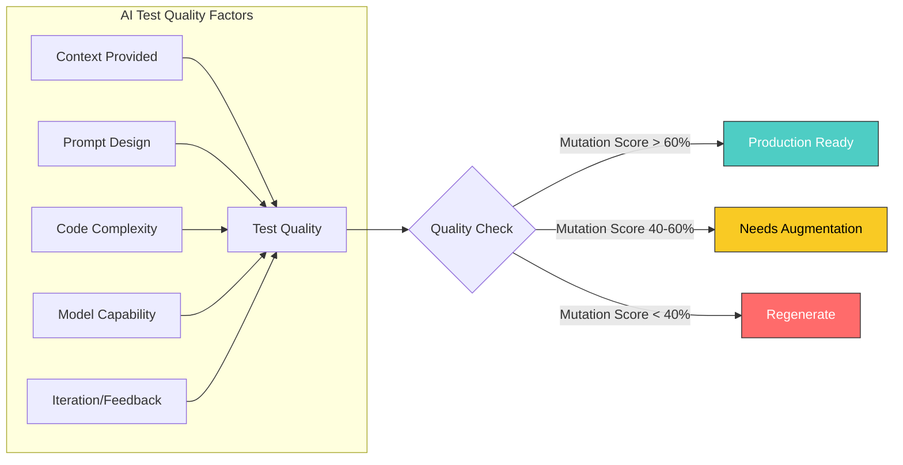
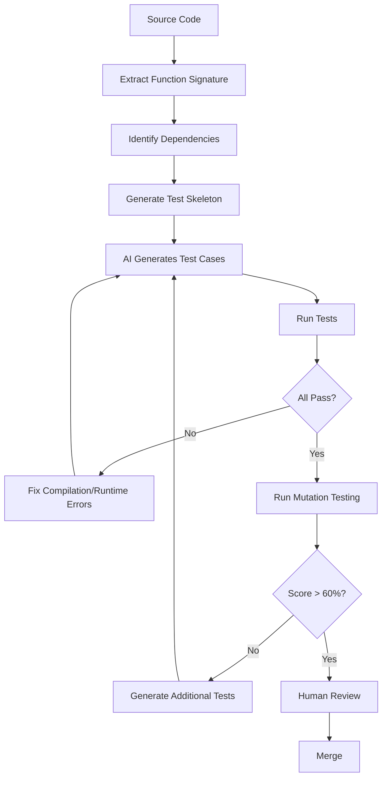
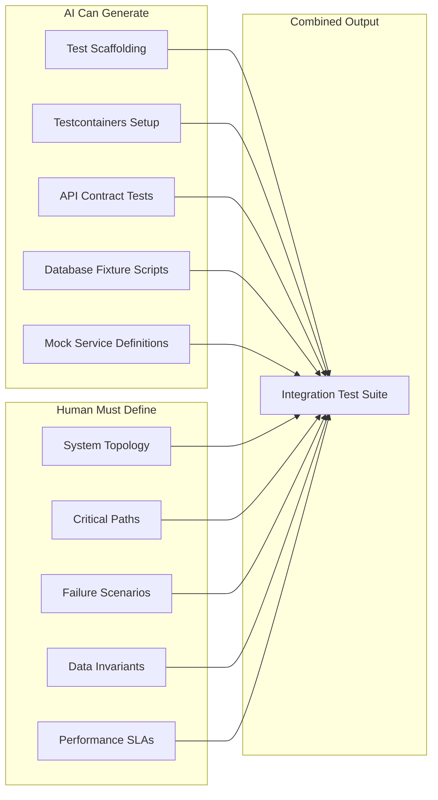
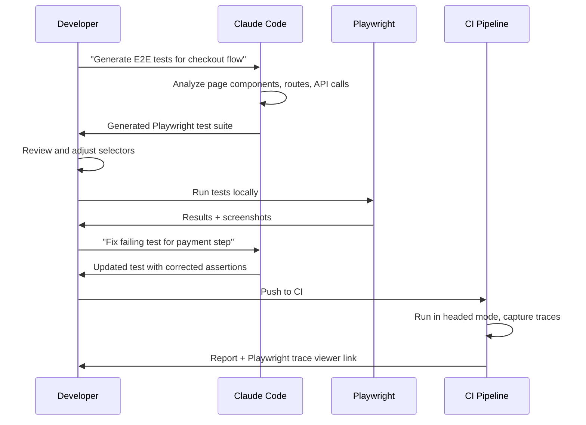
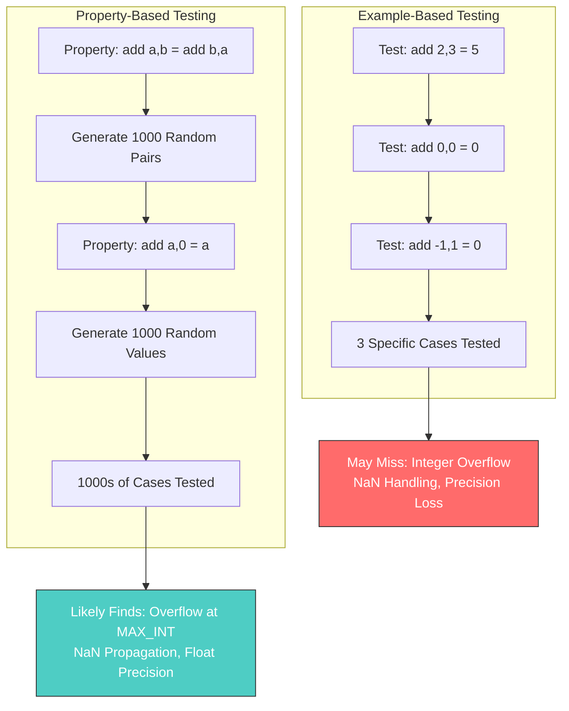
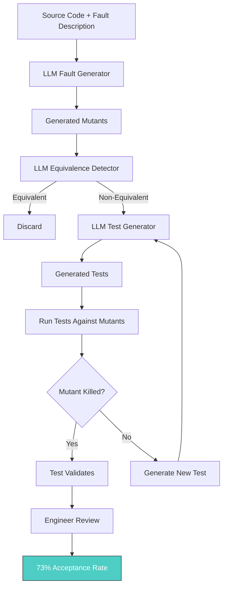
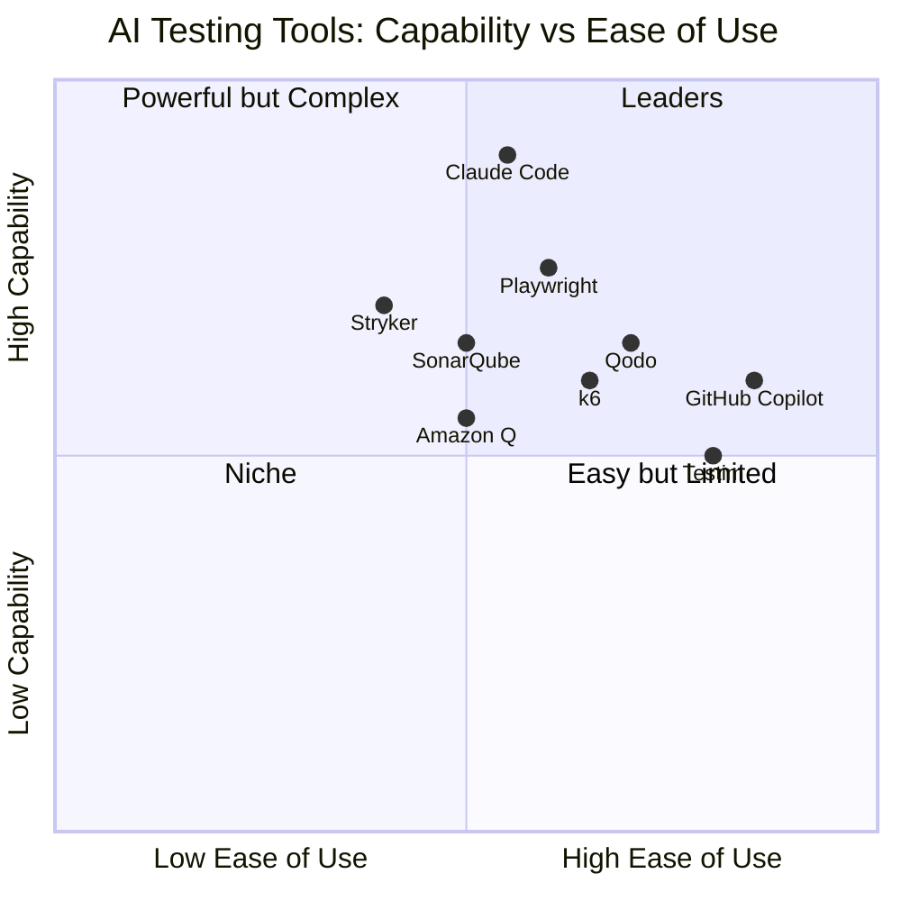
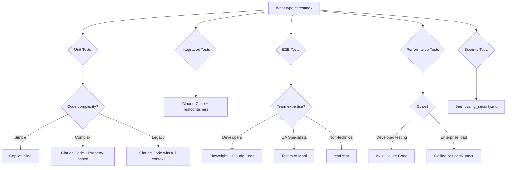

# AI Test Generation: Comprehensive Guide

> Unit, integration, e2e, property-based, and mutation testing with AI. Includes tool comparisons, effectiveness data, and working Claude Code skills for each type.

---

## Table of Contents

- [Effectiveness Data](#effectiveness-data)
- [Unit Test Generation](#unit-test-generation)
- [Integration Test Generation](#integration-test-generation)
- [End-to-End Test Generation](#end-to-end-test-generation)
- [Property-Based Testing](#property-based-testing)
- [Mutation Testing](#mutation-testing)
- [Test Data Generation](#test-data-generation)
- [Tool Comparison Matrix](#tool-comparison-matrix)
- [Claude Code Skills](#claude-code-skills)

---

## Effectiveness Data

### What Research Shows (2025-2026)

| Metric | LLM-Generated | Traditional (EvoSuite) | Human-Written |
|--------|--------------|----------------------|---------------|
| Statement Coverage (median) | 70.2% | 42.1% | 85-95% |
| Branch Coverage (median) | 52.8% | 31.4% | 70-85% |
| Mutation Score | 45-62% | 35-50% | 65-85% |
| Test Uniqueness (vs existing) | 92.8% non-duplicate | N/A | N/A |
| Engineer Acceptance Rate | 73% (Meta ACH) | N/A | N/A |
| Time to Generate | Seconds | Minutes | Hours-Days |

### Key Findings

1. **Context matters enormously**: LLMs perform significantly better when given both the problem description AND the solution code
2. **Prompt engineering drives quality**: The difference between a naive and an optimized prompt is 2-3x in coverage
3. **Semantic diversity is a weakness**: AI tests often cluster around similar scenarios; explicit diversity prompting helps
4. **Complex code degrades quality**: AI excels at simple-to-moderate functions; complex business logic needs human augmentation
5. **Open-source LLMs lag behind**: Commercial models (Claude, GPT-4) significantly outperform open-source for test generation



---

## Unit Test Generation

### The Process



### Best Practices for AI Unit Test Generation

**DO:**
- Provide the full function implementation, not just the signature
- Include type definitions and interface contracts
- Specify edge cases you know about
- Ask for boundary value analysis explicitly
- Request both positive and negative test cases
- Ask for mocking strategies for dependencies

**DO NOT:**
- Accept tests that only test the happy path
- Trust assertions that are too broad (`toBeDefined`, `toBeTruthy`)
- Skip reviewing mock setups (AI often mocks incorrectly)
- Generate tests without running them
- Accept tests that mirror implementation (testing implementation details)

### Example: Optimal Prompting for Unit Tests

```markdown
## Prompt Template for Unit Test Generation

Write comprehensive unit tests for the following function:

```typescript
// Include full implementation here
```

**Requirements:**
1. Use [Jest/pytest/JUnit] as the testing framework
2. Test these scenarios:
   - Happy path with typical inputs
   - Edge cases: empty inputs, null/undefined, boundary values
   - Error paths: invalid inputs, network failures, timeout scenarios
   - Concurrency: if applicable, test race conditions
3. For each test, include a descriptive name explaining WHAT is being tested and WHY
4. Use proper mocking for external dependencies (do not call real APIs/databases)
5. Assert on specific values, not just truthiness
6. Include at least one test that would fail if a key line of logic were removed

**Context:**
- This function is called by [describe callers]
- It interacts with [describe dependencies]
- Known invariants: [list any business rules]
```

### Tool Comparison: Unit Test Generation

| Tool | Strengths | Weaknesses | Best Use Case |
|------|-----------|------------|---------------|
| **Claude Code** | Deep reasoning, multi-file context (1M tokens), architecture-aware | Requires good prompting, no IDE integration for inline completion | Complex business logic, refactoring existing tests |
| **GitHub Copilot** | Inline completion, fast iteration, IDE integration | Limited context window, shallow reasoning for complex cases | Quick tests during development |
| **Qodo (CodiumAI)** | Test-focused, behavior coverage analysis, auto-generates scenarios | Smaller context, less architectural awareness | Generating initial test suites |
| **Amazon Q Developer** | AWS service knowledge, security scanning | Limited non-AWS context | AWS Lambda, CDK, SDK testing |
| **Sourcery** | Python-focused, code quality + tests | Python only | Python unit tests |

---

## Integration Test Generation

### The Challenge

Integration tests are harder for AI because they require:
- Understanding system topology
- Knowledge of real service behavior vs mocks
- Database state management
- Network configuration awareness
- Container orchestration knowledge

### AI-Assisted Integration Test Strategy



### Example: Claude Code Integration Test Skill

```markdown
## /integration-test Skill

Generate integration tests for a service endpoint.

**Input Required:**
- API endpoint specification (OpenAPI/Swagger or description)
- Database schema for relevant tables
- List of downstream services called
- Authentication mechanism

**Output:**
1. Testcontainers configuration for dependencies
2. Test fixtures and seed data
3. Integration test cases covering:
   - Successful request/response cycle
   - Downstream service failure handling
   - Database transaction rollback on error
   - Authentication/authorization edge cases
   - Rate limiting behavior
4. Cleanup scripts

**Framework:** [Detect from project: Jest/Vitest/pytest/JUnit]
```

### Working Integration Test Template (TypeScript/Jest)

```typescript
// Generated by Claude Code /integration-test skill
import { GenericContainer, StartedTestContainer } from 'testcontainers';
import { Pool } from 'pg';
import request from 'supertest';
import { app } from '../src/app';

describe('UserService Integration', () => {
  let pgContainer: StartedTestContainer;
  let pool: Pool;

  beforeAll(async () => {
    // AI generates container setup from schema
    pgContainer = await new GenericContainer('postgres:16')
      .withEnvironment({
        POSTGRES_DB: 'testdb',
        POSTGRES_USER: 'test',
        POSTGRES_PASSWORD: 'test',
      })
      .withExposedPorts(5432)
      .start();

    pool = new Pool({
      host: pgContainer.getHost(),
      port: pgContainer.getMappedPort(5432),
      database: 'testdb',
      user: 'test',
      password: 'test',
    });

    // AI generates schema migration from project files
    await pool.query(`
      CREATE TABLE users (
        id SERIAL PRIMARY KEY,
        email VARCHAR(255) UNIQUE NOT NULL,
        created_at TIMESTAMP DEFAULT NOW()
      );
    `);
  }, 60_000);

  afterAll(async () => {
    await pool.end();
    await pgContainer.stop();
  });

  beforeEach(async () => {
    await pool.query('TRUNCATE users RESTART IDENTITY CASCADE');
  });

  it('creates a user and returns 201', async () => {
    const res = await request(app)
      .post('/api/users')
      .send({ email: 'test@example.com' })
      .expect(201);

    expect(res.body).toMatchObject({
      id: expect.any(Number),
      email: 'test@example.com',
    });

    // Verify in database
    const { rows } = await pool.query(
      'SELECT * FROM users WHERE email = $1',
      ['test@example.com']
    );
    expect(rows).toHaveLength(1);
  });

  it('returns 409 for duplicate email', async () => {
    await pool.query(
      "INSERT INTO users (email) VALUES ('existing@example.com')"
    );

    await request(app)
      .post('/api/users')
      .send({ email: 'existing@example.com' })
      .expect(409);
  });

  it('handles database connection failure gracefully', async () => {
    // Simulate by stopping the container temporarily
    await pgContainer.stop();

    const res = await request(app)
      .post('/api/users')
      .send({ email: 'test@example.com' });

    expect(res.status).toBe(503);
    expect(res.body.error).toMatch(/service unavailable/i);
  });
});
```

---

## End-to-End Test Generation

### The 2026 E2E Landscape

| Framework | Weekly NPM Downloads | AI Compatibility | Best For |
|-----------|---------------------|-----------------|----------|
| **Playwright** | 20-30M | Excellent (JS scripts, easy AI generation) | Cross-browser, CI/CD, parallel |
| **Cypress** | 8-12M | Good (JS scripts, strong DX) | Frontend-focused, debugging |
| **Autonoma** | Emerging | Native (generates from source) | Teams wanting zero-script E2E |
| **Testim** | Enterprise | Built-in (self-healing) | Enterprise with visual testing |
| **testRigor** | Growing | Native (plain English tests) | Non-technical QA teams |

### AI E2E Test Generation Approach



### Example: Claude Code E2E Skill

```markdown
## /e2e-test Skill

Generate Playwright end-to-end tests for a user flow.

**Input:**
- Description of the user flow in plain English
- Target URL or route
- Authentication requirements (if any)

**Process:**
1. Analyze the described flow to identify pages, actions, and expected outcomes
2. Generate Playwright test file with:
   - Page Object Model classes for each page involved
   - Test cases for the happy path
   - Tests for common failure modes (network error, invalid input, timeout)
   - Visual comparison snapshots where applicable
3. Include accessibility checks using @axe-core/playwright
4. Add performance assertions (page load < 3s, LCP < 2.5s)

**Output Format:** Playwright TypeScript test file + Page Object files
```

### Working E2E Template (Playwright)

```typescript
// Generated by Claude Code /e2e-test skill
import { test, expect } from '@playwright/test';
import AxeBuilder from '@axe-core/playwright';

// Page Object: LoginPage
class LoginPage {
  constructor(private page: import('@playwright/test').Page) {}

  async goto() {
    await this.page.goto('/login');
  }

  async login(email: string, password: string) {
    await this.page.getByLabel('Email').fill(email);
    await this.page.getByLabel('Password').fill(password);
    await this.page.getByRole('button', { name: 'Sign in' }).click();
  }

  async expectError(message: string) {
    await expect(this.page.getByRole('alert')).toContainText(message);
  }
}

test.describe('Login Flow', () => {
  let loginPage: LoginPage;

  test.beforeEach(async ({ page }) => {
    loginPage = new LoginPage(page);
    await loginPage.goto();
  });

  test('successful login redirects to dashboard', async ({ page }) => {
    await loginPage.login('user@example.com', 'validPassword123');
    await expect(page).toHaveURL('/dashboard');
    await expect(page.getByRole('heading', { name: 'Dashboard' })).toBeVisible();
  });

  test('invalid credentials show error', async ({ page }) => {
    await loginPage.login('user@example.com', 'wrongPassword');
    await loginPage.expectError('Invalid email or password');
    await expect(page).toHaveURL('/login');
  });

  test('empty form shows validation errors', async ({ page }) => {
    await page.getByRole('button', { name: 'Sign in' }).click();
    await loginPage.expectError('Email is required');
  });

  test('page is accessible', async ({ page }) => {
    const accessibilityScanResults = await new AxeBuilder({ page }).analyze();
    expect(accessibilityScanResults.violations).toEqual([]);
  });

  test('page loads within performance budget', async ({ page }) => {
    const startTime = Date.now();
    await loginPage.goto();
    const loadTime = Date.now() - startTime;
    expect(loadTime).toBeLessThan(3000);
  });
});
```

---

## Property-Based Testing

### Why Property-Based Testing Matters for AI Code

**Property-based testing finds 3x more bugs in AI-generated code** compared to traditional example-based tests. This is because:

1. AI-generated code often handles explicit examples well but fails on edge cases
2. Property tests explore the input space randomly, finding unexpected failures
3. AI tends to generate tests that mirror its own logic — property tests break this pattern
4. Shrinking (automatic minimization of failing inputs) makes bugs easier to understand



### Property-Based Testing Frameworks

| Language | Framework | Maturity | AI Generation Quality |
|----------|-----------|----------|----------------------|
| JavaScript/TS | fast-check | Excellent | High (AI knows it well) |
| Python | Hypothesis | Excellent | High |
| Java | jqwik | Good | Medium |
| Rust | proptest | Good | Medium |
| Haskell | QuickCheck | Excellent | Medium (less training data) |
| Go | rapid | Good | Medium |

### Example: Claude Code Property-Based Test Skill

```markdown
## /property-test Skill

Generate property-based tests for a function.

**Input:**
- Function implementation
- Known invariants or business rules (optional - will be inferred)

**Process:**
1. Analyze function signature and behavior
2. Identify properties:
   - Algebraic properties (commutativity, associativity, idempotency)
   - Round-trip properties (encode/decode, serialize/deserialize)
   - Invariant preservation (sorted output stays sorted, length constraints)
   - Oracle properties (compare against a simple reference implementation)
   - Metamorphic properties (if input changes by X, output changes by Y)
3. Generate property tests with appropriate generators
4. Include shrinking configuration for complex types

**Output:** Property-based test file with documented properties
```

### Working Property-Based Test Example (TypeScript/fast-check)

```typescript
// Generated by Claude Code /property-test skill
import fc from 'fast-check';
import { sortUsers, filterActiveUsers, mergeUserProfiles } from '../src/users';

describe('sortUsers properties', () => {
  const userArb = fc.record({
    id: fc.uuid(),
    name: fc.string({ minLength: 1, maxLength: 100 }),
    age: fc.integer({ min: 0, max: 150 }),
    active: fc.boolean(),
    createdAt: fc.date({ min: new Date('2000-01-01'), max: new Date('2030-01-01') }),
  });

  // Property: Output length equals input length (no elements lost or gained)
  it('preserves array length', () => {
    fc.assert(
      fc.property(fc.array(userArb), (users) => {
        expect(sortUsers(users, 'name')).toHaveLength(users.length);
      })
    );
  });

  // Property: Output is actually sorted
  it('produces sorted output by the specified field', () => {
    fc.assert(
      fc.property(fc.array(userArb), (users) => {
        const sorted = sortUsers(users, 'age');
        for (let i = 1; i < sorted.length; i++) {
          expect(sorted[i].age).toBeGreaterThanOrEqual(sorted[i - 1].age);
        }
      })
    );
  });

  // Property: Idempotency — sorting twice gives the same result
  it('is idempotent', () => {
    fc.assert(
      fc.property(fc.array(userArb), (users) => {
        const once = sortUsers(users, 'name');
        const twice = sortUsers(once, 'name');
        expect(twice).toEqual(once);
      })
    );
  });

  // Property: All elements in output exist in input (no fabrication)
  it('output contains only input elements', () => {
    fc.assert(
      fc.property(fc.array(userArb, { minLength: 1 }), (users) => {
        const sorted = sortUsers(users, 'name');
        const inputIds = new Set(users.map((u) => u.id));
        sorted.forEach((u) => expect(inputIds.has(u.id)).toBe(true));
      })
    );
  });
});

describe('filterActiveUsers properties', () => {
  const userArb = fc.record({
    id: fc.uuid(),
    name: fc.string({ minLength: 1 }),
    active: fc.boolean(),
  });

  // Property: All returned users are active
  it('returns only active users', () => {
    fc.assert(
      fc.property(fc.array(userArb), (users) => {
        const result = filterActiveUsers(users);
        result.forEach((u) => expect(u.active).toBe(true));
      })
    );
  });

  // Property: No active user is missing from the result
  it('includes all active users', () => {
    fc.assert(
      fc.property(fc.array(userArb), (users) => {
        const result = filterActiveUsers(users);
        const activeCount = users.filter((u) => u.active).length;
        expect(result).toHaveLength(activeCount);
      })
    );
  });

  // Property: Result is a subset of input
  it('result length is <= input length', () => {
    fc.assert(
      fc.property(fc.array(userArb), (users) => {
        expect(filterActiveUsers(users).length).toBeLessThanOrEqual(users.length);
      })
    );
  });
});
```

---

## Mutation Testing

### Overview

Mutation testing is the **gold standard for measuring test quality**. It works by introducing small bugs (mutants) into your code and checking whether your tests catch them. A test suite that misses many mutants is weak, regardless of its coverage percentage.

### Meta's ACH System: The State of the Art

Meta's Automated Compliance Hardening (ACH) system, published at FSE 2025, represents the most advanced production deployment of AI-powered mutation testing.



**Key Results from Meta ACH:**
- Applied to **10,795 Android Kotlin classes** across 7 platforms
- Generated **9,095 mutants** and **571 privacy-hardening test cases**
- Deployed on Facebook Feed, Instagram, Messenger, and WhatsApp
- Equivalence detector: **0.79 precision, 0.47 recall** (0.95/0.96 with pre-processing)
- Engineer acceptance rate: **73%** (36% judged privacy-relevant)

### Mutation Testing Tools

| Tool | Languages | AI Integration | Mutant Types |
|------|-----------|---------------|--------------|
| **Stryker** | JS/TS, C#, Scala | None (pair with Claude) | 30+ mutant types |
| **PIT (Pitest)** | Java/Kotlin | None (pair with Claude) | 16+ mutant types |
| **mutmut** | Python | None (pair with Claude) | AST-based mutations |
| **Meta ACH** | Kotlin (internal) | Native LLM | Domain-specific |
| **Cosmic Ray** | Python | None | AST-based mutations |

### Claude Code Mutation Testing Skill

```markdown
## /mutation-test Skill

Run mutation testing and generate tests to kill surviving mutants.

**Input:**
- Source file to mutate
- Existing test file
- Mutation testing tool output (surviving mutants)

**Process:**
1. Parse mutation testing report to identify surviving mutants
2. For each surviving mutant:
   a. Analyze what code change the mutant represents
   b. Determine why existing tests don't catch it
   c. Generate a test that specifically targets this mutant
3. Group new tests by the behavior they validate
4. Output new tests with clear documentation of which mutant each kills

**Output:**
- Additional test cases targeting surviving mutants
- Summary of mutation score improvement
- Recommendations for structural test improvements
```

### Example Workflow

```bash
# Step 1: Run mutation testing
npx stryker run --mutate 'src/utils/pricing.ts'

# Step 2: Feed surviving mutants to Claude
claude "Here are the surviving mutants from Stryker:

Mutant 1 (line 15): Changed '>' to '>=' — NOT KILLED
Mutant 2 (line 23): Removed 'if (discount > 0)' block — NOT KILLED
Mutant 3 (line 31): Changed 'tax * rate' to 'tax / rate' — NOT KILLED

Current test file: [paste test file]
Source file: [paste source file]

Generate tests that kill each surviving mutant. For each test,
explain which mutant it targets and why the existing tests missed it."

# Step 3: Run mutation testing again to verify improvement
npx stryker run --mutate 'src/utils/pricing.ts'
```

---

## Test Data Generation

### AI-Powered Synthetic Data Tools (2026)

| Tool | Data Types | Privacy Features | Best For |
|------|-----------|-----------------|----------|
| **K2view** | Tabular, relational | Masking + synthetic | Enterprise test data management |
| **Gretel** | Tabular, text, JSON, events | Differential privacy | API-driven workflows |
| **MOSTLY AI** | Tabular, sequential | Privacy-preserving | Regulated industries |
| **Syntho** | Tabular, relational | GDPR-compliant | European enterprises |
| **Tonic.ai** | Database snapshots | De-identification | Staging environments |
| **Claude Code** | Any structured format | Custom rules | Ad-hoc test fixtures |

**Market context:** 60% of data used for AI/analytics in 2025 is synthetically generated. Gartner predicts synthetic data will surpass real data for AI model development by 2030.

### Claude Code Test Data Skill

```markdown
## /test-data Skill

Generate realistic test data for a given schema.

**Input:**
- Database schema, TypeScript interface, or JSON schema
- Number of records needed
- Any constraints (uniqueness, referential integrity, value ranges)
- Data sensitivity level (can use realistic names/emails or must be synthetic)

**Process:**
1. Parse the schema to understand field types and relationships
2. Generate data that:
   - Respects all constraints and foreign keys
   - Includes edge cases (max length strings, boundary numbers, null where allowed)
   - Has realistic distribution (not all the same pattern)
   - Includes adversarial inputs (SQL injection attempts, XSS payloads, Unicode)
3. Output in requested format (SQL INSERT, JSON, CSV, factory functions)

**Output:** Test data in the requested format + edge case documentation
```

### Working Test Data Factory (TypeScript)

```typescript
// Generated by Claude Code /test-data skill
import { faker } from '@faker-js/faker';

interface UserFactory {
  build(overrides?: Partial<User>): User;
  buildList(count: number, overrides?: Partial<User>): User[];
  buildEdgeCases(): User[];
}

export const userFactory: UserFactory = {
  build(overrides = {}) {
    return {
      id: faker.string.uuid(),
      email: faker.internet.email().toLowerCase(),
      name: faker.person.fullName(),
      age: faker.number.int({ min: 18, max: 99 }),
      role: faker.helpers.arrayElement(['admin', 'user', 'moderator']),
      createdAt: faker.date.past({ years: 2 }),
      ...overrides,
    };
  },

  buildList(count, overrides = {}) {
    return Array.from({ length: count }, () => this.build(overrides));
  },

  buildEdgeCases() {
    return [
      // Maximum length values
      this.build({ name: 'A'.repeat(255), email: `${'a'.repeat(243)}@example.com` }),
      // Minimum valid values
      this.build({ name: 'A', age: 18 }),
      // Unicode and special characters
      this.build({ name: "O'Brien-Smith Jr.", email: 'user+tag@sub.domain.com' }),
      this.build({ name: '\u5F20\u4F1F', email: 'unicode@\u4F8B\u3048.jp' }),
      // Boundary values
      this.build({ age: 0 }),
      this.build({ age: 150 }),
      // SQL injection attempt (for security testing)
      this.build({ name: "Robert'); DROP TABLE users;--" }),
      // XSS attempt (for security testing)
      this.build({ name: '<script>alert("xss")</script>' }),
    ];
  },
};
```

---

## Tool Comparison Matrix

### Comprehensive AI Testing Tool Comparison



### Decision Guide



---

## Claude Code Skills

### Master Skill: Test Suite Generator

```markdown
## /generate-tests Skill

Comprehensive test generation skill that orchestrates all test types.

**Usage:**
```
/generate-tests <file-or-directory> [--type unit|integration|e2e|property|all] [--framework jest|pytest|junit] [--coverage-target 80]
```

**Workflow:**
1. Analyze the target code to determine:
   - Language and framework
   - Existing test patterns in the project
   - Dependencies and their mock requirements
   - Complexity hotspots
2. Generate tests based on type:
   - `unit`: Function-level tests with mocks
   - `integration`: Service-level tests with Testcontainers
   - `e2e`: User flow tests with Playwright
   - `property`: Property-based tests with fast-check/Hypothesis
   - `all`: Progressive generation starting with unit, then property, then integration
3. Run generated tests and fix any failures
4. Run mutation testing on unit tests
5. Report:
   - Coverage achieved (statement, branch, mutation)
   - Tests generated per category
   - Known gaps and recommendations

**Quality Checks:**
- No test should use `toBeTruthy()` or `toBeDefined()` as primary assertions
- Every test must have a descriptive name explaining the scenario
- Mocks must be verified (called with expected arguments)
- At least 20% of tests should be negative/error cases
```

### Skill: Test Review Agent

```markdown
## /review-tests Skill

Review AI-generated or human-written tests for quality issues.

**Checks Performed:**
1. **Assertion Quality**: Are assertions specific enough to catch bugs?
2. **Test Independence**: Does each test set up its own state?
3. **Mock Correctness**: Are mocks realistic? Do they verify interactions?
4. **Edge Case Coverage**: Are boundary values, nulls, and error paths tested?
5. **Flakiness Risk**: Are there timing dependencies, shared state, or network calls?
6. **Implementation Coupling**: Do tests break when refactoring without changing behavior?
7. **Naming Clarity**: Can you understand what failed from the test name alone?
8. **Mutation Resilience**: Would simple code mutations survive these tests?

**Output:** Markdown report with severity ratings and specific fix suggestions.
```

### Skill: TDD Workflow

```markdown
## /tdd Skill

Guide through the Red-Green-Refactor cycle.

**Process:**
1. **Red**: Write a failing test for the next piece of behavior
   - Ask: "What should this code do that it doesn't yet?"
   - Write the minimal test that captures this behavior
   - Verify the test fails for the right reason
2. **Green**: Write the minimal code to make the test pass
   - No extra features, no premature optimization
   - Just enough to turn the test green
3. **Refactor**: Improve the code while keeping tests green
   - Extract methods, rename variables, remove duplication
   - Run tests after each refactor step

**When TDD is Most Valuable:**
- New features with clear requirements
- Bug fixes (write the failing test first)
- Complex business logic
- API contracts
- State machines

**When to Skip TDD:**
- Prototyping / throwaway code
- UI layout (use visual testing instead)
- Simple CRUD with no business logic
```

---

## Sources

- [Empirical Study of Unit Test Generation with LLMs](https://arxiv.org/html/2406.18181v1)
- [Empirical Evaluation of LLMs for Automated Unit Test Generation](https://arxiv.org/abs/2302.06527)
- [Meta ACH: Mutation-Guided LLM Test Generation](https://arxiv.org/abs/2501.12862)
- [Meta: Revolutionizing Software Testing with LLM-Powered Bug Catchers](https://engineering.fb.com/2025/02/05/security/revolutionizing-software-testing-llm-powered-bug-catchers-meta-ach/)
- [Meta: LLMs Are the Key to Mutation Testing](https://engineering.fb.com/2025/09/30/security/llms-are-the-key-to-mutation-testing-and-better-compliance/)
- [Review of LLMs for Automated Test Case Generation](https://www.mdpi.com/2504-4990/7/3/97)
- [LLM-Powered Test Case Generation: Enhancing Coverage](https://www.frugaltesting.com/blog/llm-powered-test-case-generation-enhancing-coverage-and-efficiency)
- [Claude Code Best Practices](https://code.claude.com/docs/en/best-practices)
- [Improving Skill-Creator: Test, Measure, Refine Agent Skills](https://claude.com/blog/improving-skill-creator-test-measure-and-refine-agent-skills)
- [E2E Testing Tools in 2026](https://www.getautonoma.com/blog/e2e-testing-tools)
- [AI-Assisted Testing Guide: Playwright, Cypress & QA Future 2026](https://www.askantech.com/ai-assisted-testing-playwright-cypress-guide-2026/)
