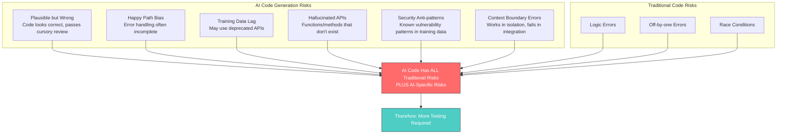
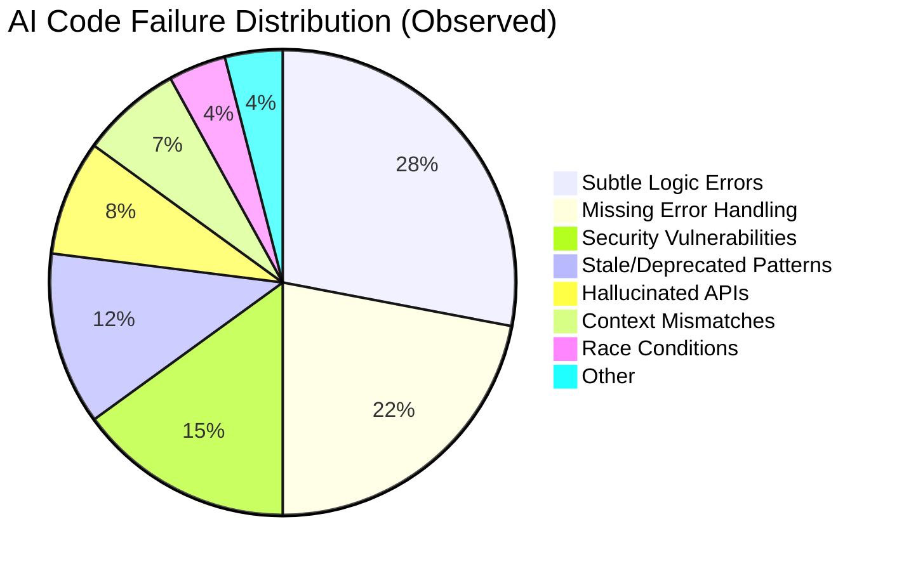
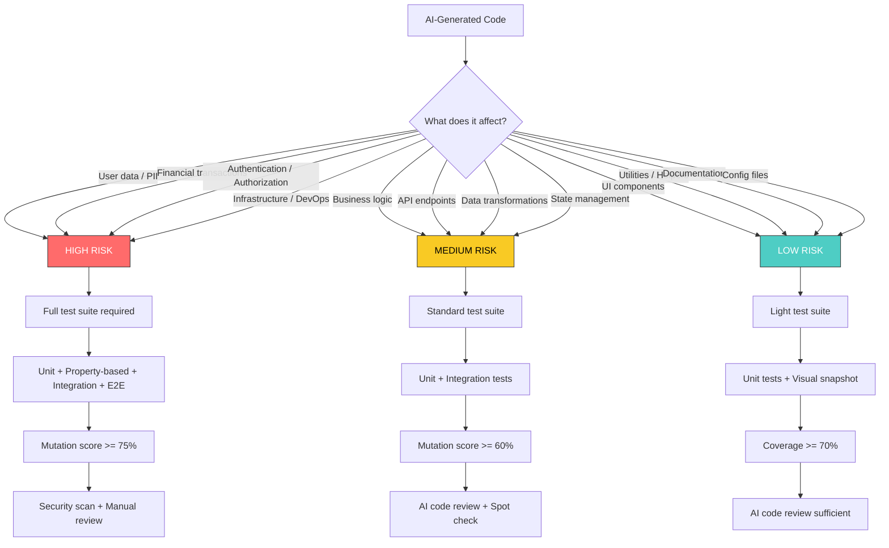
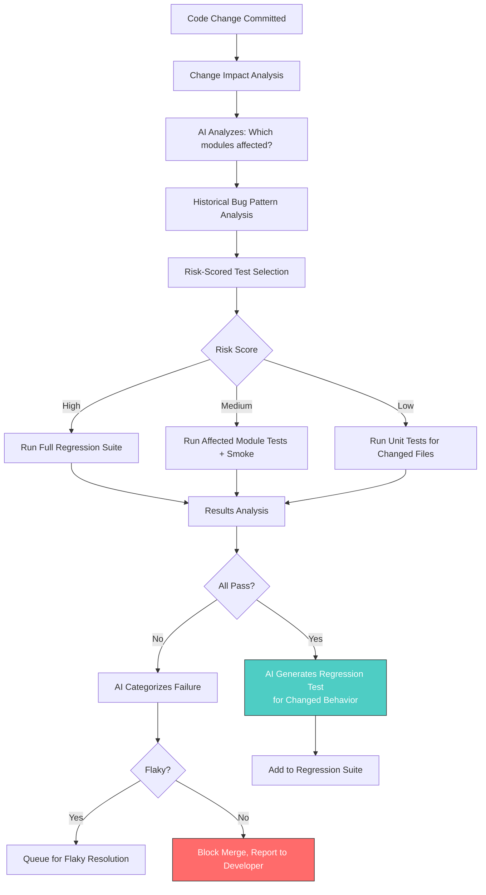
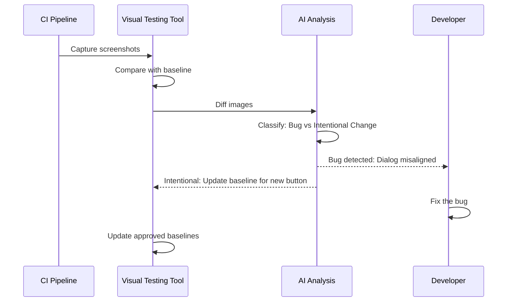
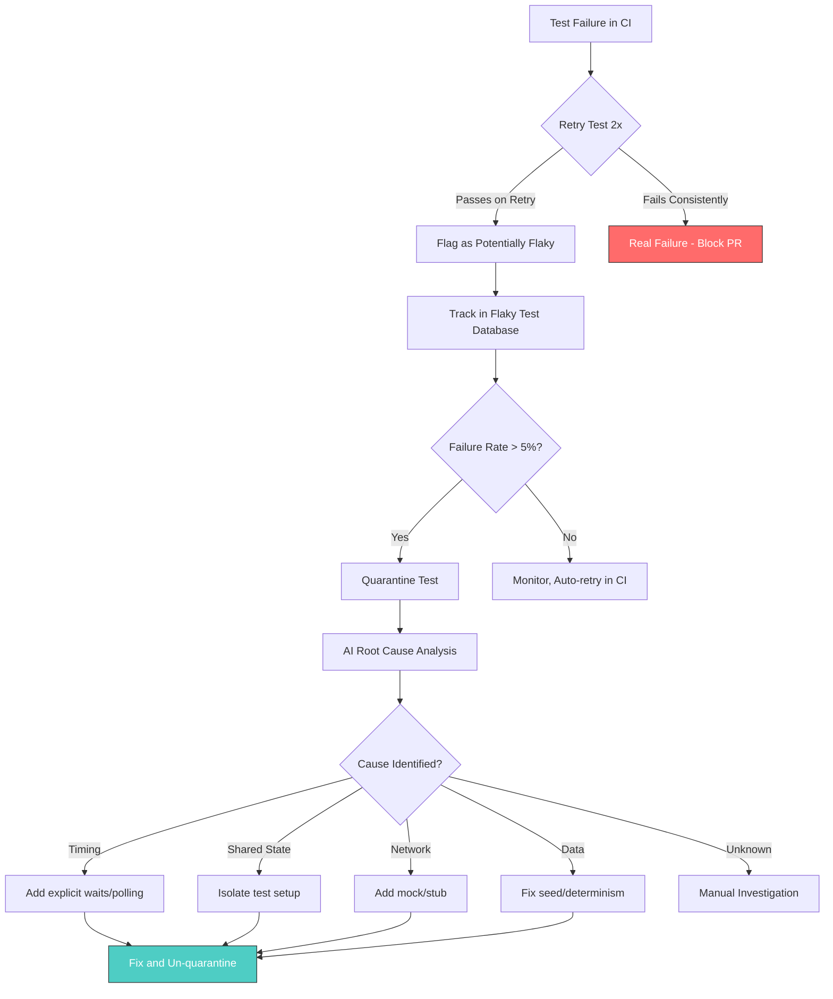
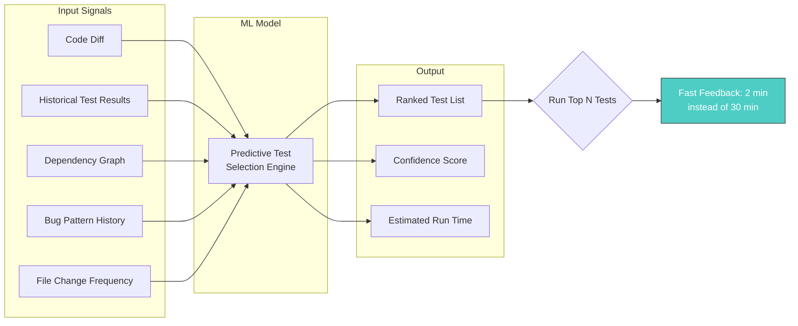

# Testing Strategies for AI-Generated Code

> Why AI-generated code needs MORE testing, not less. Coverage targets, review checklists, regression approaches, and predictive test selection.

---

## Table of Contents

- [The Case for More Testing](#the-case-for-more-testing)
- [AI Code Failure Taxonomy](#ai-code-failure-taxonomy)
- [Testing Strategy by Risk Level](#testing-strategy-by-risk-level)
- [Coverage Targets](#coverage-targets)
- [Review Checklists](#review-checklists)
- [Regression Approaches](#regression-approaches)
- [Flaky Test Management](#flaky-test-management)
- [Predictive Test Selection](#predictive-test-selection)
- [Claude Code Skills](#claude-code-skills)

---

## The Case for More Testing

### Why AI Code Requires Extra Scrutiny



### The Trust Calibration Problem

Developers tend to **over-trust** AI-generated code because:
1. It compiles and runs on the first try more often than expected
2. It includes comments that explain what it does (but not what it should do)
3. It follows conventions and patterns that look professional
4. Review fatigue: when AI produces large amounts of code, humans skim

**Research finding:** AI-generated code has a vulnerability density of 1.5-4 per KLOC compared to the industry median of 2.5 per KLOC. The code looks clean but hides subtle defects that static analysis and mutation testing can catch.

---

## AI Code Failure Taxonomy

### Categories of AI-Generated Code Failures

| Category | Description | Detection Method | Example |
|----------|-------------|-----------------|---------|
| **Hallucinated API** | Calls a function/method that doesn't exist | Type checker, compiler | `response.json.parse()` instead of `JSON.parse(response)` |
| **Stale Pattern** | Uses a deprecated or removed API | Deprecation linter, up-to-date docs | `componentWillMount` in React 19 |
| **Subtle Logic Error** | Code is plausible but produces wrong results for some inputs | Property-based testing, mutation testing | Off-by-one in boundary check |
| **Missing Error Path** | Happy path works, error handling absent or wrong | Fault injection, negative tests | No catch on async database call |
| **Security Vulnerability** | Known vuln pattern from training data | SAST tools, security scanning | SQL string concatenation |
| **Race Condition** | Concurrent access not handled | Stress testing, property-based with concurrency | Shared mutable state without locks |
| **Context Mismatch** | Code correct in isolation, wrong in project context | Integration tests, code review | Using wrong database connection pool |
| **Incomplete Implementation** | Handles some cases, silently ignores others | Mutation testing, edge case tests | Switch statement missing cases |
| **Over-Abstraction** | Unnecessarily complex for the requirements | Complexity metrics, code review | 3-layer factory pattern for simple object creation |
| **Copy-Paste Drift** | Generated similar code with subtle differences | Duplication detection, code review | Same function duplicated with different field names |



---

## Testing Strategy by Risk Level

### Risk-Based Testing Matrix



### Detailed Strategy Per Risk Level

#### HIGH RISK: Security-Critical and Data-Sensitive Code

```markdown
Required Testing:
1. Unit tests with >= 90% branch coverage
2. Property-based tests for all input validation
3. Integration tests with real database/service interactions
4. Mutation testing with >= 75% kill rate
5. SAST scan (SonarQube + Snyk Code)
6. DAST scan for web-exposed endpoints (OWASP ZAP)
7. Fuzz testing for parser/deserializer code
8. Manual security review by senior engineer
9. E2E test covering the complete user flow

Review Requirements:
- At least 2 human reviewers
- AI code review as supplementary check
- Explicit sign-off on security considerations
- Threat model update if new attack surface introduced
```

#### MEDIUM RISK: Business Logic and API Code

```markdown
Required Testing:
1. Unit tests with >= 80% branch coverage
2. Property-based tests for core algorithms
3. Integration tests for service interactions
4. Mutation testing with >= 60% kill rate
5. SAST scan
6. API contract tests (if endpoint)

Review Requirements:
- 1 human reviewer + AI code review
- Focus review on error handling and edge cases
```

#### LOW RISK: UI Components and Utilities

```markdown
Required Testing:
1. Unit tests with >= 70% coverage
2. Visual snapshot tests (for UI)
3. Accessibility scan (for UI)
4. Basic SAST scan

Review Requirements:
- AI code review may be sufficient
- Human spot-check recommended
```

---

## Coverage Targets

### Coverage Targets by Code Type

| Code Type | Statement | Branch | Mutation | Rationale |
|-----------|-----------|--------|----------|-----------|
| **Auth/Security** | 95% | 90% | 80% | Security gaps are exploitable |
| **Financial/Payment** | 95% | 90% | 80% | Errors have direct financial cost |
| **Core Business Logic** | 85% | 80% | 70% | Defects impact users directly |
| **API Endpoints** | 85% | 80% | 65% | Integration points need coverage |
| **Data Access Layer** | 80% | 75% | 60% | Data integrity matters |
| **Utility Functions** | 80% | 75% | 65% | Widely used, bugs propagate |
| **UI Components** | 70% | 60% | N/A | Visual testing supplements |
| **Configuration** | 60% | 50% | N/A | Integration tests more valuable |
| **Scripts/Tools** | 60% | 50% | N/A | Manual verification often sufficient |

### Coverage Ratchet Strategy

Never let coverage decrease. Implement a coverage ratchet:

```json
// jest.config.ts coverage thresholds
{
  "coverageThreshold": {
    "global": {
      "statements": 80,
      "branches": 75,
      "functions": 90,
      "lines": 80
    },
    "./src/auth/": {
      "statements": 95,
      "branches": 90,
      "functions": 95,
      "lines": 95
    },
    "./src/payments/": {
      "statements": 95,
      "branches": 90,
      "functions": 95,
      "lines": 95
    }
  }
}
```

```bash
# scripts/ratchet-coverage.sh
# Automatically raise coverage threshold to current level
# Run after every successful CI build on main

CURRENT=$(node -e "const c=require('./coverage/coverage-summary.json'); console.log(JSON.stringify({s:c.total.statements.pct,b:c.total.branches.pct,f:c.total.functions.pct,l:c.total.lines.pct}))")

echo "Current coverage: $CURRENT"
echo "Update jest.config.ts thresholds to match (never decrease)"
```

---

## Review Checklists

### AI-Generated Code Review Checklist

Use this checklist when reviewing any AI-generated or AI-assisted code:

#### Correctness
- [ ] Does the code actually solve the stated problem?
- [ ] Are all edge cases handled (null, empty, boundary values)?
- [ ] Is error handling present for all external calls?
- [ ] Do all API calls reference real, existing APIs?
- [ ] Are return types correct and complete?
- [ ] Is the behavior correct for concurrent/parallel execution?

#### Security
- [ ] No SQL string concatenation (use parameterized queries)
- [ ] No user input used directly in file paths (path traversal)
- [ ] No secrets hardcoded in source code
- [ ] Input validation on all user-facing boundaries
- [ ] Output encoding for any data rendered in HTML
- [ ] Authentication/authorization checks present where needed
- [ ] Rate limiting considered for public endpoints
- [ ] Dependency versions are not pinned to vulnerable releases

#### Quality
- [ ] Functions are under 50 lines
- [ ] Cyclomatic complexity under 10 per function
- [ ] No code duplication (DRY)
- [ ] Names are descriptive and consistent with codebase conventions
- [ ] Comments explain "why" not "what"
- [ ] No TODO/FIXME without a linked ticket

#### Testing
- [ ] Tests exist for all new/changed functions
- [ ] Tests cover happy path AND error paths
- [ ] Assertions are specific (not just `toBeTruthy`)
- [ ] No test depends on external state or ordering
- [ ] Mocks are realistic and verified
- [ ] Edge cases are tested (empty, null, max values)

#### Architecture
- [ ] Code follows existing project patterns and conventions
- [ ] Dependencies are appropriate (not over-engineered)
- [ ] No unnecessary abstraction layers
- [ ] Changes are backward compatible (or migration provided)
- [ ] Performance implications considered

### AI-Generated Test Review Checklist

Use this when reviewing tests that AI generated:

- [ ] Tests actually fail when the tested behavior is broken (mutation resilience)
- [ ] Each test tests ONE behavior (no multi-assertion mega-tests)
- [ ] Test names describe the scenario and expected outcome
- [ ] No implementation-detail testing (testing private methods, internal state)
- [ ] Mocks are minimal (only mock what you must, not what you can)
- [ ] Test data is meaningful (not random magic numbers without explanation)
- [ ] No shared mutable state between tests
- [ ] Async tests have proper timeout handling
- [ ] No `sleep()` or timing-dependent assertions
- [ ] Setup and teardown are clean and complete

---

## Regression Approaches

### AI-Powered Regression Testing Architecture



### Regression Testing Strategies

#### 1. Change Impact Analysis

```markdown
When AI generates or modifies code, identify:
- Direct dependencies (what calls this code?)
- Transitive dependencies (what calls the callers?)
- Shared state (what data does this code read/write?)
- Configuration dependencies (what env vars, feature flags?)

Then run tests for all identified impact zones.
```

#### 2. Regression Test Generation for AI Changes

```markdown
For every AI-generated change, automatically generate a regression test that:
1. Captures the BEFORE behavior (snapshot)
2. Verifies the AFTER behavior matches intent
3. Guards against reversion

This prevents the specific bug pattern where AI "fixes" code by reverting
a previous fix it doesn't know about.
```

#### 3. Self-Healing Tests

Modern AI test platforms (Testim, Mabl, Datadog) offer self-healing capabilities:

| Platform | Self-Healing Approach | Best For |
|----------|----------------------|----------|
| **Testim** | AI updates selectors when UI changes | Selenium/Playwright E2E |
| **Mabl** | Auto-adapts to UI element changes | Low-code E2E |
| **Datadog Bits AI** | Categorizes flaky failures, generates PR fixes | CI pipeline flakiness |
| **Launchable** | ML-based test selection by code change | Large test suites |

#### 4. Visual Regression Testing



**Tool comparison:**
- **Applitools**: Visual AI, 78% maintenance reduction (Peloton case study)
- **Percy (BrowserStack)**: Snapshot testing, good CI integration
- **Chromatic (Storybook)**: Component-level visual testing
- **Playwright**: Built-in screenshot comparison (toHaveScreenshot)

---

## Flaky Test Management

### The Flaky Test Problem

Flaky tests (tests that pass or fail non-deterministically) erode confidence in the test suite. AI can both cause and solve flakiness.

**AI-caused flakiness:**
- Tests that depend on specific timing or ordering
- Tests that use real API calls instead of mocks
- Tests with non-deterministic data (random seeds, timestamps)
- Tests that share state through global variables

### Flaky Test Detection and Resolution Pipeline



### Datadog Bits AI Approach

Datadog's Bits AI Dev Agent represents the state of the art in automated flaky test resolution (2025-2026):

1. **Detection**: Collects deep data from pipelines — historical runs, execution traces, logs from the exact failure moment
2. **Categorization**: AI classifies the problem type
3. **Fix Generation**: Autonomously generates a verified code fix
4. **Delivery**: Packages the fix as a production-ready PR for immediate review

### Flaky Test Prevention Checklist

For AI-generated tests, enforce these rules:

```markdown
## Anti-Flakiness Rules for AI Tests

1. **No real time dependencies**
   - BAD: `expect(Date.now()).toBeGreaterThan(startTime)`
   - GOOD: Use `jest.useFakeTimers()` or inject a clock

2. **No network calls in unit tests**
   - BAD: `await fetch('https://api.example.com/data')`
   - GOOD: Mock with `jest.mock()` or MSW (Mock Service Worker)

3. **No shared mutable state**
   - BAD: Global variable modified by multiple tests
   - GOOD: Fresh setup in beforeEach, isolated test data

4. **No order-dependent tests**
   - Run with `--randomize` flag to verify independence

5. **No implicit waits**
   - BAD: `await new Promise(r => setTimeout(r, 1000))`
   - GOOD: `await waitFor(() => expect(element).toBeVisible())`

6. **Deterministic random data**
   - BAD: `Math.random()`
   - GOOD: `faker.seed(12345)` or explicit test values

7. **Explicit cleanup**
   - Every beforeEach/afterEach must clean up what it creates
   - Use database transactions that roll back
```

---

## Predictive Test Selection

### How It Works

Predictive test selection uses machine learning to determine which tests are most likely to fail for a given code change, enabling faster CI feedback.



### Tools for Predictive Test Selection

| Tool | Approach | Integration | Reduction in Test Time |
|------|----------|------------|----------------------|
| **Launchable** | ML model trained on test/code history | Any CI, language-agnostic | 50-80% |
| **Datadog Test Optimization** | Historical run analysis + AI | Datadog CI Visibility | 40-70% |
| **Codecov Test Analytics** | Coverage-based impact analysis | GitHub/GitLab | 30-50% |
| **Gradle Enterprise** | Build cache + predictive | Gradle projects | 40-60% |
| **BuildPulse** | Flaky test detection + prioritization | Any CI | Focused on flaky reduction |

### Implementing Predictive Selection with Launchable

```yaml
# .github/workflows/predictive-tests.yml
name: Predictive Test Suite

on: pull_request

jobs:
  test:
    runs-on: ubuntu-latest
    steps:
      - uses: actions/checkout@v4
        with:
          fetch-depth: 0

      - uses: actions/setup-node@v4
        with:
          node-version: '22'

      - run: npm ci

      - name: Install Launchable CLI
        run: pip install launchable

      - name: Record build
        run: launchable record build --name ${{ github.sha }}

      - name: Get optimized test list
        run: |
          # Get test files ranked by failure probability
          npx jest --listTests | \
            launchable subset \
              --target 80% \
              --build ${{ github.sha }} \
              jest > subset.txt

      - name: Run optimized tests
        run: npx jest $(cat subset.txt)

      - name: Record results
        if: always()
        run: launchable record tests jest ./test-results/
```

---

## Claude Code Skills

### Skill: Test Strategy Recommender

```markdown
## /test-strategy Skill

Analyze a codebase or specific change and recommend a testing strategy.

**Input:**
- Code change (diff, file, or description)
- Project context (detected automatically)

**Process:**
1. Classify the change by risk level (high/medium/low)
2. Identify the failure taxonomy categories most relevant
3. Recommend specific test types needed
4. Suggest coverage targets for this specific change
5. Identify potential flakiness risks in existing tests

**Output:**
- Risk classification with justification
- Recommended test types (unit, integration, e2e, property, fuzz)
- Coverage targets for this change
- Specific edge cases to test
- Review checklist items relevant to this change
```

### Skill: Regression Guard

```markdown
## /regression-guard Skill

Generate regression tests for a specific code change to prevent reversion.

**Input:**
- The code change (before and after)
- The reason for the change (bug fix, feature, refactor)

**Process:**
1. Identify the specific behavior that changed
2. Generate a test that:
   - Would have FAILED with the old code
   - PASSES with the new code
   - Documents WHY this change was made (in test name and comments)
3. If the change is a bug fix, generate a test named:
   `it('regression: should [expected behavior] (fixes #[issue])')`

**Output:**
- Regression test file
- Documentation of what behavior is being guarded
```

### Skill: AI Code Audit

```markdown
## /ai-code-audit Skill

Audit AI-generated code against the failure taxonomy.

**Checks:**
1. **Hallucinated APIs**: Verify all imported/called functions exist
   - Check: `npx tsc --noEmit` (TypeScript)
   - Check: `python -m py_compile` (Python)
2. **Stale Patterns**: Check for deprecated API usage
   - Check: Lint rules for deprecation warnings
3. **Missing Error Handling**: Identify unhandled async/I/O operations
   - Check: Custom ESLint rule or AI analysis
4. **Security Anti-patterns**: Scan for known vulnerability patterns
   - Check: `npx snyk code test` or SonarQube
5. **Over-Abstraction**: Flag unnecessary complexity
   - Check: Cyclomatic complexity > 10, function > 50 lines

**Output:**
- Findings rated by severity
- Specific fix recommendations
- Tests to add for uncovered risks
```

### Agent: Continuous Quality Monitor

```markdown
## AI Testing Agent: Quality Sentinel

An autonomous agent that monitors code quality across the development lifecycle.

**Triggers:**
- New PR opened
- PR updated with new commits
- Main branch build completes
- Weekly scheduled scan

**Actions:**
1. On PR: Run AI code review checklist, report findings
2. On PR: Check coverage delta, warn if decreasing
3. On main build: Run mutation testing, track trend
4. Weekly: Full security scan, dependency audit, complexity report
5. On any: Detect flaky tests, open fix PRs

**Integration:**
- GitHub Actions / GitLab CI for execution
- Slack/Teams for notifications
- Dashboard for trend tracking
```

---

## Sources

- [The Future of AI Regression Testing: Scaling Quality](https://katalon.com/resources-center/blog/ai-in-regression-testing)
- [AI Regression Testing for Scalable Quality Engineering](https://testgrid.io/blog/what-is-ai-regression-testing/)
- [Datadog Bits AI Test Optimization](https://www.datadoghq.com/blog/bits-ai-test-optimization/)
- [Flaky Tests in 2026: Key Causes, Fixes, Prevention](https://www.accelq.com/blog/flaky-tests/)
- [12 AI Test Automation Tools QA Teams Actually Use](https://testguild.com/7-innovative-ai-test-automation-tools-future-third-wave/)
- [AI-Powered Regression Testing Tools Overview 2025](https://www.frugaltesting.com/blog/ai-powered-regression-testing-tools-a-comprehensive-overview-2025)
- [Assessing Quality and Security of AI-Generated Code](https://arxiv.org/abs/2508.14727)
- [Applitools Visual AI Testing](https://app14743.cloudwayssites.com/blog/playwright-visual-testing-strategy/)
- [The 2026 Guide to AI-Powered Test Automation Tools](https://dev.to/matt_calder_e620d84cf0c14/the-2026-guide-to-ai-powered-test-automation-tools-5f24)
